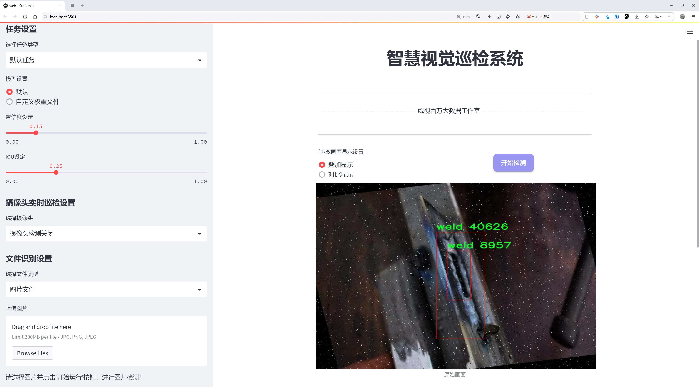
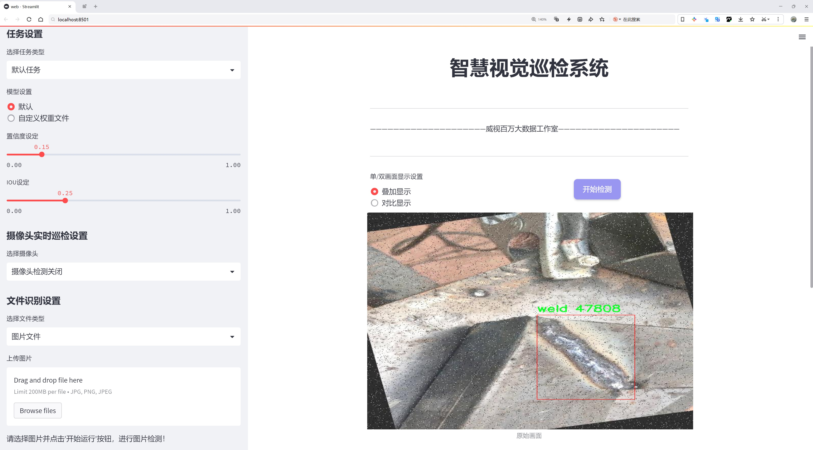
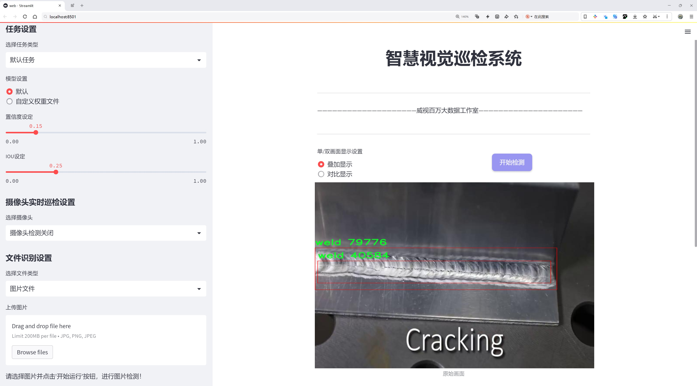
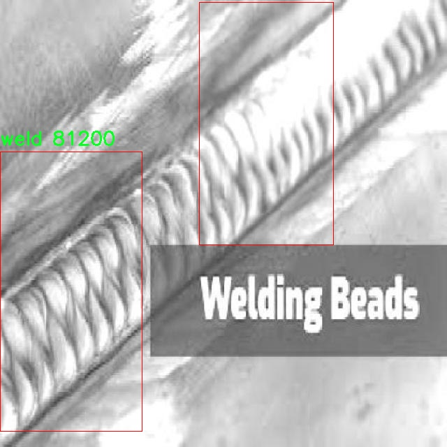
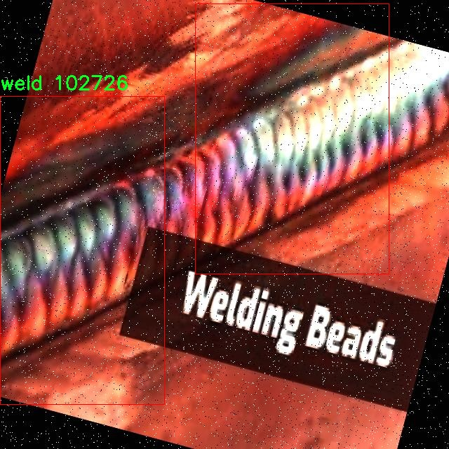

# 焊接缺陷检测检测系统源码分享
 # [一条龙教学YOLOV8标注好的数据集一键训练_70+全套改进创新点发刊_Web前端展示]

### 1.研究背景与意义

项目参考[AAAI Association for the Advancement of Artificial Intelligence](https://gitee.com/qunmasj/projects)

项目来源[AACV Association for the Advancement of Computer Vision](https://kdocs.cn/l/cszuIiCKVNis)

研究背景与意义

焊接作为一种广泛应用于制造业的重要连接工艺，其质量直接影响到产品的安全性和可靠性。随着工业技术的不断进步，焊接工艺的复杂性和多样性也日益增加，焊接缺陷的种类和发生频率随之上升。这些缺陷包括气孔、夹渣、未焊透、焊缝不均匀等，若不及时检测和处理，将可能导致结构失效，甚至引发严重的安全事故。因此，开发高效、准确的焊接缺陷检测系统，成为了焊接行业亟待解决的技术难题。

近年来，计算机视觉和深度学习技术的快速发展，为焊接缺陷检测提供了新的解决方案。YOLO（You Only Look Once）系列目标检测算法因其高效性和实时性，逐渐成为工业检测领域的研究热点。YOLOv8作为该系列的最新版本，具备更强的特征提取能力和更高的检测精度，能够在复杂背景下快速识别目标。然而，传统YOLOv8模型在焊接缺陷检测中仍面临一些挑战，例如在处理焊接图像时，可能由于焊缝的光照变化、背景复杂性及缺陷特征的微小差异，导致检测精度下降。因此，基于改进YOLOv8的焊接缺陷检测系统的研究具有重要的现实意义。

本研究基于一个包含2515张焊接图像的数据集，旨在通过改进YOLOv8模型，提升焊接缺陷的检测能力。该数据集仅包含一个类别，即焊接缺陷，且图像数量相对较大，为模型的训练和验证提供了良好的基础。通过对数据集的深入分析，可以发现焊接缺陷的多样性和复杂性，这为模型的优化提供了方向。研究将重点关注如何通过数据增强、模型结构调整及超参数优化等手段，提升YOLOv8在焊接缺陷检测中的表现。

此外，焊接缺陷检测的自动化与智能化不仅能够提高检测效率，降低人工成本，还能在一定程度上减少人为因素对检测结果的影响，从而提升焊接产品的整体质量。随着工业4.0和智能制造的不断推进，基于深度学习的焊接缺陷检测系统将成为未来焊接行业的重要发展趋势。

综上所述，基于改进YOLOv8的焊接缺陷检测系统的研究，不仅具有重要的理论价值，也具有广泛的应用前景。通过本研究，期望能够为焊接行业提供一种高效、可靠的缺陷检测解决方案，推动焊接技术的进步与发展。同时，研究成果也将为其他领域的目标检测任务提供借鉴，促进计算机视觉技术的进一步应用与发展。

### 2.图片演示







##### 注意：由于此博客编辑较早，上面“2.图片演示”和“3.视频演示”展示的系统图片或者视频可能为老版本，新版本在老版本的基础上升级如下：（实际效果以升级的新版本为准）

  （1）适配了YOLOV8的“目标检测”模型和“实例分割”模型，通过加载相应的权重（.pt）文件即可自适应加载模型。

  （2）支持“图片识别”、“视频识别”、“摄像头实时识别”三种识别模式。

  （3）支持“图片识别”、“视频识别”、“摄像头实时识别”三种识别结果保存导出，解决手动导出（容易卡顿出现爆内存）存在的问题，识别完自动保存结果并导出到tempDir中。

  （4）支持Web前端系统中的标题、背景图等自定义修改，后面提供修改教程。

  另外本项目提供训练的数据集和训练教程,暂不提供权重文件（best.pt）,需要您按照教程进行训练后实现图片演示和Web前端界面演示的效果。

### 3.视频演示

[3.1 视频演示](https://www.bilibili.com/video/BV1MyxPeSEKq/)

### 4.数据集信息展示

##### 4.1 本项目数据集详细数据（类别数＆类别名）

nc: 1
names: ['weld']


##### 4.2 本项目数据集信息介绍

数据集信息展示

在焊接缺陷检测领域，准确性和效率是评估系统性能的关键指标。为此，本研究选用了名为“Weld detection”的数据集，旨在为改进YOLOv8模型提供高质量的训练数据。该数据集专注于焊接缺陷的识别与分类，具有重要的应用价值，尤其是在工业生产和质量控制中。数据集的设计旨在涵盖焊接过程中可能出现的各种缺陷，以确保模型在实际应用中的鲁棒性和可靠性。

“Weld detection”数据集的类别数量为1，具体类别为“weld”。这一单一类别的设置使得数据集在训练过程中能够专注于焊接缺陷的识别，避免了多类别之间的干扰。这种简化的分类方式使得模型能够更深入地学习焊接缺陷的特征，进而提高检测的准确性。焊接缺陷可能包括气孔、夹渣、裂纹等问题，这些缺陷不仅影响焊接接头的强度和耐久性，还可能导致整个结构的失效。因此，数据集中的图像样本经过精心挑选，确保能够代表焊接缺陷的多样性和复杂性。

在数据集的构建过程中，数据采集的来源广泛，涵盖了不同类型的焊接工艺和材料。这种多样性使得模型在训练时能够接触到各种焊接场景，从而提高其泛化能力。数据集中的图像经过标注，确保每个样本都能准确反映出焊接缺陷的存在。这些标注不仅包括缺陷的类型，还可能涉及缺陷的大小、位置等信息，为模型的训练提供了丰富的上下文。

为了确保数据集的有效性和实用性，所有图像均经过预处理，以适应YOLOv8模型的输入要求。这些预处理步骤包括图像的缩放、归一化以及数据增强等，旨在提高模型的训练效率和检测性能。数据增强技术的应用，能够有效扩展数据集的规模，增加模型对不同环境和条件下焊接缺陷的适应能力。

在实际应用中，焊接缺陷检测系统的性能不仅依赖于数据集的质量，还与模型的设计和训练策略密切相关。因此，在使用“Weld detection”数据集进行YOLOv8模型的训练时，研究者们将采用先进的训练技巧和优化算法，以确保模型能够充分利用数据集中的信息，达到最佳的检测效果。

总之，“Weld detection”数据集为焊接缺陷检测系统的研究提供了坚实的基础，凭借其专注于单一类别的设计和多样化的样本来源，能够有效提升YOLOv8模型在焊接缺陷识别中的表现。通过不断优化模型和数据集的结合，期望在未来的研究中实现更高的检测精度和更广泛的应用前景。







### 5.全套项目环境部署视频教程（零基础手把手教学）

[5.1 环境部署教程链接（零基础手把手教学）](https://www.ixigua.com/7404473917358506534?logTag=c807d0cbc21c0ef59de5)


[5.2 安装Python虚拟环境创建和依赖库安装视频教程链接（零基础手把手教学）](https://www.ixigua.com/7404474678003106304?logTag=1f1041108cd1f708b01a)

### 6.手把手YOLOV8训练视频教程（零基础小白有手就能学会）

[6.1 手把手YOLOV8训练视频教程（零基础小白有手就能学会）](https://www.ixigua.com/7404477157818401292?logTag=d31a2dfd1983c9668658)

### 7.70+种全套YOLOV8创新点代码加载调参视频教程（一键加载写好的改进模型的配置文件）

[7.1 70+种全套YOLOV8创新点代码加载调参视频教程（一键加载写好的改进模型的配置文件）](https://www.ixigua.com/7404478314661806627?logTag=29066f8288e3f4eea3a4)

### 8.70+种全套YOLOV8创新点原理讲解（非科班也可以轻松写刊发刊，V10版本正在科研待更新）

由于篇幅限制，每个创新点的具体原理讲解就不一一展开，具体见下列网址中的创新点对应子项目的技术原理博客网址【Blog】：


[8.1 70+种全套YOLOV8创新点原理讲解链接](https://gitee.com/qunmasj/good)

### 9.系统功能展示（检测对象为举例，实际内容以本项目数据集为准）

图9.1.系统支持检测结果表格显示

  图9.2.系统支持置信度和IOU阈值手动调节

  图9.3.系统支持自定义加载权重文件best.pt(需要你通过步骤5中训练获得)

  图9.4.系统支持摄像头实时识别

  图9.5.系统支持图片识别

  图9.6.系统支持视频识别

  图9.7.系统支持识别结果文件自动保存

  图9.8.系统支持Excel导出检测结果数据


### 10.原始YOLOV8算法原理

原始YOLOv8算法原理

YOLOv8算法是YOLO系列中的最新版本，由Glenn-Jocher提出，延续了YOLOv3和YOLOv5的设计理念，并在此基础上进行了多项创新和优化。作为一种单阶段目标检测算法，YOLOv8在检测精度和速度上均表现出色，适用于实时目标检测任务。其网络结构主要由输入模块、Backbone骨干网络、Neck特征融合网络和Head检测模块四个部分组成，形成了一个高效的目标检测系统。

在数据预处理方面，YOLOv8延续了YOLOv5的策略，采用了多种数据增强技术，以提高模型的泛化能力和鲁棒性。具体而言，YOLOv8在训练过程中使用了马赛克增强、混合增强、空间扰动和颜色扰动等方法。这些增强手段不仅丰富了训练数据的多样性，还有效地减少了模型对特定样本的过拟合，从而提升了检测性能。

YOLOv8的骨干网络结构是其核心之一，继承了YOLOv5的设计思路，但进行了重要的改进。YOLOv8用C2f模块替代了YOLOv5中的C3模块。C2f模块的设计理念在于引入更多的分支，以增强梯度回传过程中的信息流动。通过这种方式，YOLOv8能够更有效地提取特征，保持轻量级特性，同时确保网络在不同层次上都能获得丰富的特征信息。此外，YOLOv8在主干网络中采用了CSP结构，将特征提取过程分为卷积和连接两个部分，进一步提高了特征提取的效率。

在特征融合方面，YOLOv8依然采用了FPN（特征金字塔网络）和PAN（路径聚合网络）的组合结构。这种结构使得多尺度信息能够充分融合，提升了模型对不同尺度目标的检测能力。YOLOv8的Neck部分通过引入C2f模块，增强了特征融合的能力，使得网络在处理复杂场景时能够更好地保留语义信息和定位信息，从而提高了整体的检测精度。

YOLOv8的检测模块采用了解耦头结构，这是YOLO系列的一项重要创新。与之前的耦合头结构不同，解耦头将分类和定位任务分开处理，使得模型在执行这两个任务时能够更加高效。具体而言，YOLOv8的检测模块包含三个Detect检测器，分别负责提取类别特征和位置特征。通过这种解耦设计，YOLOv8在训练过程中能够更快地收敛，提高了模型的整体性能。

在标签分配策略方面，YOLOv8引入了动态标签分配策略，解决了正负样本匹配的问题。与YOLOX使用的SimOTA策略不同，YOLOv8采用了与YOLOv6相同的TOOD策略。这种策略的核心在于只使用目标框和目标分数进行标签分配，而不依赖于候选框的聚类。通过这种方式，YOLOv8能够更好地适应不同数据集的特征，确保模型在训练过程中获得更准确的标签信息。

YOLOv8的损失函数设计也进行了创新，分类损失采用了VFL Loss（Varifocal Loss），而回归损失则结合了CIoULoss和DFLLoss。VFL Loss通过不对称参数对正负样本进行加权，使得网络在训练时能够更加关注高质量的正样本，从而提升检测精度。同时，负样本的损失贡献被有效降低，避免了负样本对模型训练的干扰。这种设计使得YOLOv8在处理复杂场景时，能够更好地聚焦于重要的目标，提高了整体的检测性能。

综上所述，YOLOv8算法通过对数据预处理、骨干网络、特征融合、检测模块和标签分配策略等多个方面的优化，显著提升了目标检测的精度和速度。其创新的解耦头结构和动态标签分配策略，使得YOLOv8在实时目标检测任务中表现出色，成为了YOLO系列中一款具有重要意义的算法。随着YOLOv8的推出，目标检测技术将迎来新的发展机遇，为各类应用场景提供更加高效和准确的解决方案。


### 11.项目核心源码讲解（再也不用担心看不懂代码逻辑）

#### 11.1 code\train.py

以下是代码的核心部分，并附上详细的中文注释：

```python
import os
import torch
import yaml
from ultralytics import YOLO  # 导入YOLO模型
from QtFusion.path import abs_path  # 导入获取绝对路径的函数

# 设置设备为GPU（如果可用），否则使用CPU
device = "0" if torch.cuda.is_available() else "cpu"

if __name__ == '__main__':  # 确保该模块被直接运行时才执行以下代码
    workers = 1  # 设置数据加载的工作进程数
    batch = 2    # 设置每个批次的大小

    data_name = "data"  # 数据集名称
    # 获取数据集yaml文件的绝对路径
    data_path = abs_path(f'datasets/{data_name}/{data_name}.yaml', path_type='current')  
    unix_style_path = data_path.replace(os.sep, '/')  # 将路径转换为Unix风格

    # 获取目录路径
    directory_path = os.path.dirname(unix_style_path)
    
    # 读取YAML文件，保持原有顺序
    with open(data_path, 'r') as file:
        data = yaml.load(file, Loader=yaml.FullLoader)
    
    # 修改YAML文件中的path项为当前目录路径
    if 'path' in data:
        data['path'] = directory_path
        # 将修改后的数据写回YAML文件
        with open(data_path, 'w') as file:
            yaml.safe_dump(data, file, sort_keys=False)

    # 加载预训练的YOLOv8模型
    model = YOLO(model='./ultralytics/cfg/models/v8/yolov8s.yaml', task='detect')  
    
    # 开始训练模型
    results2 = model.train(  
        data=data_path,  # 指定训练数据的配置文件路径
        device=device,  # 使用指定的设备进行训练
        workers=workers,  # 指定使用的工作进程数
        imgsz=640,  # 指定输入图像的大小为640x640
        epochs=100,  # 指定训练100个epoch
        batch=batch,  # 指定每个批次的大小
        name='train_v8_' + data_name  # 指定训练任务的名称
    )
```

### 代码分析与注释说明：

1. **导入必要的库**：
   - `os`：用于处理文件和目录路径。
   - `torch`：用于深度学习模型的训练和推理。
   - `yaml`：用于读取和写入YAML格式的配置文件。
   - `YOLO`：从`ultralytics`库中导入YOLO模型，进行目标检测。
   - `abs_path`：用于获取文件的绝对路径。

2. **设备选择**：
   - 通过`torch.cuda.is_available()`判断是否有可用的GPU，如果有则使用GPU（设备编号为"0"），否则使用CPU。

3. **主程序块**：
   - 使用`if __name__ == '__main__':`确保代码仅在直接运行该脚本时执行。

4. **数据集配置**：
   - `data_name`指定数据集的名称。
   - `data_path`通过`abs_path`获取数据集配置文件的绝对路径，并将路径格式转换为Unix风格。

5. **读取和修改YAML文件**：
   - 使用`yaml.load`读取YAML文件内容，并将其存储在`data`变量中。
   - 如果YAML文件中存在`path`项，则将其修改为当前目录路径，并使用`yaml.safe_dump`将修改后的内容写回文件。

6. **模型加载与训练**：
   - 加载YOLOv8模型，指定模型配置文件路径。
   - 调用`model.train`方法开始训练，传入训练数据路径、设备、工作进程数、图像大小、训练轮数、批次大小和训练任务名称等参数。

此代码的核心功能是加载数据集、配置模型并进行训练，适用于目标检测任务。

这段代码是一个用于训练YOLOv8目标检测模型的Python脚本。首先，它导入了必要的库，包括`os`、`torch`、`yaml`和`ultralytics`中的YOLO模型。接着，它根据系统是否支持CUDA来选择设备，如果支持则使用GPU（"0"），否则使用CPU（"cpu"）。

在`__main__`块中，代码首先定义了一些训练参数，包括工作进程数`workers`和批次大小`batch`。然后，指定了数据集的名称为`data`，并构建了数据集配置文件的绝对路径。通过`abs_path`函数，代码将相对路径转换为绝对路径，并将路径中的分隔符统一为Unix风格的斜杠。

接下来，代码获取了数据集目录的路径，并打开指定的YAML文件以读取数据集配置。读取后，如果配置中包含`path`项，则将其修改为当前目录路径，并将更新后的数据写回YAML文件中，以确保模型可以正确找到数据集。

然后，代码加载了YOLOv8模型的配置文件，准备进行目标检测任务。接下来，调用`model.train`方法开始训练模型。在训练过程中，指定了训练数据的配置文件路径、设备、工作进程数、输入图像的大小（640x640）、训练的epoch数量（100）以及每个批次的大小（2）。最后，训练任务的名称被设置为`train_v8_`加上数据集名称。

总体而言，这段代码实现了YOLOv8模型的训练过程，包括数据集的配置、模型的加载和训练参数的设置。

#### 11.2 70+种YOLOv8算法改进源码大全和调试加载训练教程（非必要）\ultralytics\utils\callbacks\tensorboard.py

以下是代码中最核心的部分，并附上详细的中文注释：

```python
# 导入必要的库
from ultralytics.utils import LOGGER, SETTINGS, TESTS_RUNNING, colorstr

try:
    # 尝试导入TensorBoard的SummaryWriter，用于记录训练过程中的指标
    from torch.utils.tensorboard import SummaryWriter

    # 确保当前不是在测试环境中运行
    assert not TESTS_RUNNING  
    # 确保TensorBoard集成已启用
    assert SETTINGS['tensorboard'] is True  
    WRITER = None  # 初始化TensorBoard的SummaryWriter实例

except (ImportError, AssertionError, TypeError):
    # 处理导入错误或断言错误，确保在Windows上处理protobuf相关的错误
    SummaryWriter = None

def _log_scalars(scalars, step=0):
    """将标量值记录到TensorBoard中。"""
    if WRITER:  # 如果WRITER已初始化
        for k, v in scalars.items():  # 遍历标量字典
            WRITER.add_scalar(k, v, step)  # 记录每个标量

def _log_tensorboard_graph(trainer):
    """将模型图记录到TensorBoard中。"""
    try:
        import warnings
        from ultralytics.utils.torch_utils import de_parallel, torch

        imgsz = trainer.args.imgsz  # 获取输入图像的大小
        imgsz = (imgsz, imgsz) if isinstance(imgsz, int) else imgsz  # 确保图像大小为元组
        p = next(trainer.model.parameters())  # 获取模型参数以确定设备和类型
        im = torch.zeros((1, 3, *imgsz), device=p.device, dtype=p.dtype)  # 创建一个输入图像（必须是零而不是空）

        with warnings.catch_warnings():
            warnings.simplefilter('ignore', category=UserWarning)  # 忽略JIT跟踪警告
            WRITER.add_graph(torch.jit.trace(de_parallel(trainer.model), im, strict=False), [])  # 记录模型图
    except Exception as e:
        LOGGER.warning(f'WARNING ⚠️ TensorBoard图形可视化失败 {e}')  # 记录警告信息

def on_pretrain_routine_start(trainer):
    """使用SummaryWriter初始化TensorBoard日志记录。"""
    if SummaryWriter:  # 如果SummaryWriter可用
        try:
            global WRITER
            WRITER = SummaryWriter(str(trainer.save_dir))  # 初始化SummaryWriter并指定日志目录
            prefix = colorstr('TensorBoard: ')
            LOGGER.info(f"{prefix}使用 'tensorboard --logdir {trainer.save_dir}' 启动，查看地址为 http://localhost:6006/")  # 提示用户如何查看TensorBoard
        except Exception as e:
            LOGGER.warning(f'WARNING ⚠️ TensorBoard未正确初始化，未记录此次运行。 {e}')  # 记录警告信息

def on_train_start(trainer):
    """记录TensorBoard图形。"""
    if WRITER:  # 如果WRITER已初始化
        _log_tensorboard_graph(trainer)  # 记录模型图

def on_batch_end(trainer):
    """在训练批次结束时记录标量统计信息。"""
    _log_scalars(trainer.label_loss_items(trainer.tloss, prefix='train'), trainer.epoch + 1)  # 记录当前批次的损失

def on_fit_epoch_end(trainer):
    """在训练周期结束时记录周期指标。"""
    _log_scalars(trainer.metrics, trainer.epoch + 1)  # 记录当前周期的指标

# 定义回调函数字典，根据SummaryWriter是否可用来决定是否注册回调
callbacks = {
    'on_pretrain_routine_start': on_pretrain_routine_start,
    'on_train_start': on_train_start,
    'on_fit_epoch_end': on_fit_epoch_end,
    'on_batch_end': on_batch_end} if SummaryWriter else {}
```

### 代码核心部分说明：
1. **TensorBoard的初始化**：尝试导入`SummaryWriter`，并确保在非测试环境中且TensorBoard集成已启用。
2. **标量记录**：定义了`_log_scalars`函数用于将训练过程中的标量值（如损失）记录到TensorBoard。
3. **模型图记录**：`_log_tensorboard_graph`函数用于记录模型的计算图，便于可视化模型结构。
4. **回调函数**：定义了一系列回调函数，在训练的不同阶段（如开始训练、每个批次结束、每个周期结束）进行相应的日志记录。
5. **回调字典**：根据`SummaryWriter`的可用性，动态生成回调函数字典，以便在训练过程中调用。

这个程序文件是一个用于集成TensorBoard的回调函数模块，主要用于在Ultralytics YOLO模型训练过程中记录和可视化训练过程中的各种指标。文件中首先导入了一些必要的模块和工具，包括日志记录器、设置和TensorBoard的SummaryWriter。

在尝试导入SummaryWriter时，程序会进行一些安全检查，以确保在测试运行时不会记录日志，并且确认TensorBoard集成已启用。如果导入失败或出现断言错误，SummaryWriter将被设置为None，以避免后续代码执行时出现错误。

接下来，定义了几个函数来处理不同的日志记录任务。`_log_scalars`函数用于将标量值记录到TensorBoard中，它接收一个字典形式的标量数据和步数作为参数，并通过SummaryWriter将这些数据添加到TensorBoard中。

`_log_tensorboard_graph`函数用于将模型的计算图记录到TensorBoard中。它会创建一个输入张量，并使用Torch的JIT追踪功能来记录模型的结构。如果在记录过程中发生异常，程序会捕获并记录警告信息。

`on_pretrain_routine_start`函数在训练前的例程开始时被调用，用于初始化TensorBoard的日志记录。它会创建一个SummaryWriter实例，并输出相关的日志信息，提示用户如何启动TensorBoard以查看训练过程。

`on_train_start`函数在训练开始时被调用，负责记录模型的计算图。

`on_batch_end`函数在每个训练批次结束时被调用，记录当前批次的标量统计信息。

`on_fit_epoch_end`函数在每个训练周期结束时被调用，记录当前周期的指标。

最后，程序将这些回调函数存储在一个字典中，只有在成功导入SummaryWriter的情况下才会执行。这些回调函数可以在训练过程中被触发，以便实时记录和可视化训练进展。

#### 11.3 ui.py

```python
import sys
import subprocess

def run_script(script_path):
    """
    使用当前 Python 环境运行指定的脚本。

    Args:
        script_path (str): 要运行的脚本路径

    Returns:
        None
    """
    # 获取当前 Python 解释器的路径
    python_path = sys.executable

    # 构建运行命令，使用 streamlit 运行指定的脚本
    command = f'"{python_path}" -m streamlit run "{script_path}"'

    # 执行命令，并等待其完成
    result = subprocess.run(command, shell=True)
    
    # 检查命令执行结果，如果返回码不为0，表示执行出错
    if result.returncode != 0:
        print("脚本运行出错。")

# 实例化并运行应用
if __name__ == "__main__":
    # 指定要运行的脚本路径
    script_path = "web.py"  # 这里可以直接使用相对路径

    # 调用函数运行脚本
    run_script(script_path)
```

### 代码核心部分及注释说明：

1. **导入模块**：
   - `sys`：用于访问与 Python 解释器相关的变量和函数。
   - `subprocess`：用于执行外部命令。

2. **定义 `run_script` 函数**：
   - 此函数接受一个参数 `script_path`，表示要运行的 Python 脚本的路径。
   - 使用 `sys.executable` 获取当前 Python 解释器的路径，以确保使用正确的 Python 环境。

3. **构建命令**：
   - 使用 `streamlit` 模块运行指定的脚本，构建的命令格式为：`python -m streamlit run script_path`。

4. **执行命令**：
   - 使用 `subprocess.run` 执行构建的命令，并通过 `shell=True` 允许在 shell 中执行命令。
   - 检查命令的返回码，如果返回码不为0，表示脚本运行出错，打印错误信息。

5. **主程序入口**：
   - 使用 `if __name__ == "__main__":` 确保只有在直接运行该脚本时才会执行以下代码。
   - 指定要运行的脚本路径，并调用 `run_script` 函数来执行该脚本。

这个程序文件名为 `ui.py`，主要功能是通过当前的 Python 环境来运行一个指定的脚本。程序的第一部分导入了必要的模块，包括 `sys`、`os` 和 `subprocess`，以及一个自定义的模块 `QtFusion.path` 中的 `abs_path` 函数。

在 `run_script` 函数中，首先定义了一个参数 `script_path`，用于接收要运行的脚本的路径。函数内部首先获取当前 Python 解释器的路径，这样可以确保在正确的环境中运行脚本。接着，构建了一个命令字符串，使用 `streamlit` 模块来运行指定的脚本。`streamlit` 是一个用于构建数据应用的流行库。

然后，使用 `subprocess.run` 方法执行构建好的命令。如果脚本运行过程中出现错误，返回码不为零，程序会打印出“脚本运行出错”的提示信息。

在文件的最后部分，使用 `if __name__ == "__main__":` 来确保只有在直接运行该文件时才会执行以下代码。这里指定了要运行的脚本路径为 `web.py`，并调用 `run_script` 函数来执行这个脚本。

总的来说，这个程序的作用是提供一个简单的接口，通过当前的 Python 环境来运行一个名为 `web.py` 的脚本，并处理可能出现的错误。

#### 11.4 code\ultralytics\models\utils\__init__.py

以下是对给定代码的核心部分进行提炼和详细注释的结果：

```python
# Ultralytics YOLO 🚀, AGPL-3.0 license

# YOLO（You Only Look Once）是一种实时目标检测算法，Ultralytics是该算法的一个实现版本。
# AGPL-3.0是该代码的许可证，允许用户自由使用、修改和分发，但要求在分发时也要开放源代码。

# 这里是YOLO模型的核心部分，通常包括模型的定义、训练和推理等功能。
# 具体实现会涉及到数据加载、模型构建、损失计算、优化器设置等。

# 下面是一个伪代码示例，展示YOLO模型的基本结构和功能：

class YOLO:
    def __init__(self, model_config):
        # 初始化YOLO模型，加载模型配置
        self.model_config = model_config
        self.model = self.build_model()  # 构建模型

    def build_model(self):
        # 构建YOLO模型的具体结构
        # 这里会定义卷积层、激活函数、池化层等
        pass

    def train(self, train_data):
        # 训练模型的函数
        # 1. 加载训练数据
        # 2. 进行前向传播
        # 3. 计算损失
        # 4. 反向传播并更新权重
        pass

    def predict(self, input_data):
        # 模型推理函数
        # 1. 对输入数据进行预处理
        # 2. 进行前向传播，得到预测结果
        # 3. 对结果进行后处理，提取目标检测框
        pass

# 实例化YOLO模型并进行训练和推理
yolo_model = YOLO(model_config='path/to/config')
yolo_model.train(train_data='path/to/train_data')
predictions = yolo_model.predict(input_data='path/to/input_image')
```

### 注释说明：
1. **YOLO类**：定义了YOLO模型的基本结构，包括初始化、模型构建、训练和推理的方法。
2. **`__init__`方法**：构造函数，接受模型配置并调用`build_model`方法构建模型。
3. **`build_model`方法**：负责定义YOLO模型的具体结构，通常包括卷积层、激活函数等。
4. **`train`方法**：用于训练模型，涉及数据加载、前向传播、损失计算和权重更新等步骤。
5. **`predict`方法**：用于模型推理，处理输入数据并输出目标检测结果。

以上是YOLO模型的核心部分及其功能的详细注释。

这个文件是Ultralytics YOLO项目的一部分，主要用于实现YOLO（You Only Look Once）系列的目标检测模型。文件名为`__init__.py`，在Python中，这个文件通常用于标识一个目录为一个包，并可以包含包的初始化代码。

在这个文件中，第一行是一个注释，表明该项目是Ultralytics YOLO，并且使用AGPL-3.0许可证。这意味着该项目是开源的，用户可以自由使用、修改和分发，但需要遵循AGPL许可证的条款。

由于文件内容非常简短，仅包含这一行注释，说明这个文件可能主要用于包的初始化，实际的功能和实现可能在其他模块或文件中。`__init__.py`文件的存在使得Python能够将该目录视为一个模块，从而可以导入其中的其他功能和类。

总的来说，这个文件是Ultralytics YOLO项目的一个基本组成部分，虽然内容简单，但它在组织代码结构和模块导入方面起着重要作用。

#### 11.5 code\ultralytics\engine\results.py

以下是代码中最核心的部分，并附上详细的中文注释：

```python
class BaseTensor(SimpleClass):
    """基础张量类，提供额外的方法以便于操作和设备管理。"""

    def __init__(self, data, orig_shape) -> None:
        """
        初始化 BaseTensor，包含数据和原始形状。

        参数:
            data (torch.Tensor | np.ndarray): 预测结果，例如边界框、掩码和关键点。
            orig_shape (tuple): 图像的原始形状。
        """
        assert isinstance(data, (torch.Tensor, np.ndarray))  # 确保数据是张量或数组
        self.data = data  # 存储数据
        self.orig_shape = orig_shape  # 存储原始形状

    @property
    def shape(self):
        """返回数据张量的形状。"""
        return self.data.shape

    def cpu(self):
        """返回一个在CPU内存上的张量副本。"""
        return self if isinstance(self.data, np.ndarray) else self.__class__(self.data.cpu(), self.orig_shape)

    def numpy(self):
        """返回一个作为numpy数组的张量副本。"""
        return self if isinstance(self.data, np.ndarray) else self.__class__(self.data.numpy(), self.orig_shape)

    def cuda(self):
        """返回一个在GPU内存上的张量副本。"""
        return self.__class__(torch.as_tensor(self.data).cuda(), self.orig_shape)

    def to(self, *args, **kwargs):
        """返回一个具有指定设备和数据类型的张量副本。"""
        return self.__class__(torch.as_tensor(self.data).to(*args, **kwargs), self.orig_shape)

    def __len__(self):  # 重写len(results)
        """返回数据张量的长度。"""
        return len(self.data)

    def __getitem__(self, idx):
        """返回指定索引的数据张量的BaseTensor副本。"""
        return self.__class__(self.data[idx], self.orig_shape)


class Results(SimpleClass):
    """
    存储和操作推理结果的类。

    参数:
        orig_img (numpy.ndarray): 原始图像的numpy数组。
        path (str): 图像文件的路径。
        names (dict): 类别名称的字典。
        boxes (torch.tensor, optional): 每个检测的边界框坐标的2D张量。
        masks (torch.tensor, optional): 检测掩码的3D张量，每个掩码是一个二进制图像。
        probs (torch.tensor, optional): 每个类别的概率的1D张量。
        keypoints (List[List[float]], optional): 每个对象的检测关键点的列表。

    属性:
        orig_img (numpy.ndarray): 原始图像的numpy数组。
        orig_shape (tuple): 原始图像的形状，格式为(height, width)。
        boxes (Boxes, optional): 包含检测边界框的Boxes对象。
        masks (Masks, optional): 包含检测掩码的Masks对象。
        probs (Probs, optional): 包含分类任务每个类别概率的Probs对象。
        keypoints (Keypoints, optional): 包含每个对象检测关键点的Keypoints对象。
        speed (dict): 预处理、推理和后处理速度的字典，以毫秒为单位。
        names (dict): 类别名称的字典。
        path (str): 图像文件的路径。
        _keys (tuple): 非空属性的属性名称元组。
    """

    def __init__(self, orig_img, path, names, boxes=None, masks=None, probs=None, keypoints=None, obb=None) -> None:
        """初始化Results类。"""
        self.orig_img = orig_img  # 存储原始图像
        self.orig_shape = orig_img.shape[:2]  # 存储原始图像的形状
        self.boxes = Boxes(boxes, self.orig_shape) if boxes is not None else None  # 存储边界框
        self.masks = Masks(masks, self.orig_shape) if masks is not None else None  # 存储掩码
        self.probs = Probs(probs) if probs is not None else None  # 存储概率
        self.keypoints = Keypoints(keypoints, self.orig_shape) if keypoints is not None else None  # 存储关键点
        self.obb = OBB(obb, self.orig_shape) if obb is not None else None  # 存储定向边界框
        self.speed = {"preprocess": None, "inference": None, "postprocess": None}  # 速度信息
        self.names = names  # 存储类别名称
        self.path = path  # 存储图像路径
        self.save_dir = None  # 保存目录
        self._keys = "boxes", "masks", "probs", "keypoints", "obb"  # 非空属性的键

    def __getitem__(self, idx):
        """返回指定索引的Results对象。"""
        return self._apply("__getitem__", idx)

    def __len__(self):
        """返回Results对象中的检测数量。"""
        for k in self._keys:
            v = getattr(self, k)
            if v is not None:
                return len(v)

    def update(self, boxes=None, masks=None, probs=None):
        """更新Results对象的boxes、masks和probs属性。"""
        if boxes is not None:
            self.boxes = Boxes(ops.clip_boxes(boxes, self.orig_shape), self.orig_shape)
        if masks is not None:
            self.masks = Masks(masks, self.orig_shape)
        if probs is not None:
            self.probs = probs

    def _apply(self, fn, *args, **kwargs):
        """
        将函数应用于所有非空属性，并返回一个具有修改属性的新Results对象。
        该函数由.to()、.cuda()、.cpu()等方法内部调用。

        参数:
            fn (str): 要应用的函数名称。
            *args: 传递给函数的可变长度参数列表。
            **kwargs: 传递给函数的任意关键字参数。

        返回:
            Results: 一个新的Results对象，其属性由应用的函数修改。
        """
        r = self.new()  # 创建新对象
        for k in self._keys:
            v = getattr(self, k)
            if v is not None:
                setattr(r, k, getattr(v, fn)(*args, **kwargs))  # 应用函数
        return r

    def cpu(self):
        """返回一个所有张量在CPU内存上的Results对象副本。"""
        return self._apply("cpu")

    def numpy(self):
        """返回一个所有张量作为numpy数组的Results对象副本。"""
        return self._apply("numpy")

    def cuda(self):
        """返回一个所有张量在GPU内存上的Results对象副本。"""
        return self._apply("cuda")

    def to(self, *args, **kwargs):
        """返回一个具有指定设备和数据类型的Results对象副本。"""
        return self._apply("to", *args, **kwargs)

    def new(self):
        """返回一个具有相同图像、路径和名称的新Results对象。"""
        return Results(orig_img=self.orig_img, path=self.path, names=self.names)

    def plot(self, conf=True, line_width=None, font_size=None, font="Arial.ttf", pil=False, img=None, im_gpu=None, kpt_radius=5, kpt_line=True, labels=True, boxes=True, masks=True, probs=True):
        """
        在输入的RGB图像上绘制检测结果。接受numpy数组（cv2）或PIL图像。

        参数:
            conf (bool): 是否绘制检测置信度分数。
            line_width (float, optional): 边界框的线宽。如果为None，则按图像大小缩放。
            font_size (float, optional): 文本的字体大小。如果为None，则按图像大小缩放。
            font (str): 要使用的字体。
            pil (bool): 是否将图像作为PIL图像返回。
            img (numpy.ndarray): 绘制到另一张图像。如果不绘制到原始图像。
            im_gpu (torch.Tensor): 在GPU上标准化的图像，形状为(1, 3, 640, 640)，用于更快的掩码绘制。
            kpt_radius (int, optional): 绘制关键点的半径。默认值为5。
            kpt_line (bool): 是否绘制连接关键点的线。
            labels (bool): 是否绘制边界框的标签。
            boxes (bool): 是否绘制边界框。
            masks (bool): 是否绘制掩码。
            probs (bool): 是否绘制分类概率。

        返回:
            (numpy.ndarray): 注释图像的numpy数组。
        """
        # 处理图像和绘制逻辑...
        # 略去具体实现细节

        return annotator.result()  # 返回绘制结果
```

以上代码片段保留了最核心的部分，包括 `BaseTensor` 和 `Results` 类，并添加了详细的中文注释，帮助理解每个部分的功能和作用。

这个程序文件是Ultralytics YOLO模型的一部分，主要用于处理推理结果，包括检测框、掩码和关键点等。它定义了一些类，用于存储和操作这些推理结果，并提供了一些方法来方便地进行数据处理和可视化。

首先，文件中定义了一个基类`BaseTensor`，它扩展了基本的张量操作，增加了一些便捷的方法来处理设备（CPU/GPU）和数据格式（如numpy数组）。该类的构造函数接受数据和原始图像的形状，并提供了多种方法来转换数据格式，比如将数据移动到CPU或GPU，或者转换为numpy数组。

接下来是`Results`类，它用于存储和操作推理结果。该类的构造函数接受原始图像、文件路径、类别名称以及可选的检测框、掩码、概率和关键点等信息。它还定义了一些属性和方法，用于获取和更新检测结果，包括返回检测数量、更新检测框和掩码等。

`Boxes`、`Masks`、`Keypoints`、`Probs`和`OBB`类都是从`BaseTensor`类派生而来的，分别用于处理不同类型的推理结果。`Boxes`类专注于检测框的存储和操作，提供了获取框坐标、置信度和类别的方法。`Masks`类用于处理检测掩码，提供了获取像素坐标和归一化坐标的方法。`Keypoints`类用于处理关键点，提供了获取关键点坐标和置信度的方法。`Probs`类用于处理分类概率，提供了获取前几类的索引和置信度的方法。`OBB`类则用于处理定向边界框，提供了获取旋转框坐标和其他相关信息的方法。

在`Results`类中，还有一个`plot`方法，用于在输入图像上绘制检测结果。该方法接受多个参数，可以控制绘制的细节，如是否绘制置信度、框的线宽、字体大小等。绘制过程中使用了`Annotator`类来处理图像的标注和可视化。

此外，`Results`类还提供了将结果保存为文本文件、裁剪保存、转换为JSON格式等功能，方便用户对推理结果进行后续处理和分析。

总的来说，这个文件提供了一整套用于处理YOLO模型推理结果的工具，方便用户在进行目标检测和相关任务时进行数据管理和可视化。

#### 11.6 train.py

以下是经过简化并添加详细中文注释的核心代码部分：

```python
import random
import numpy as np
import torch.nn as nn
from ultralytics.data import build_dataloader, build_yolo_dataset
from ultralytics.engine.trainer import BaseTrainer
from ultralytics.models import yolo
from ultralytics.nn.tasks import DetectionModel
from ultralytics.utils import LOGGER, RANK
from ultralytics.utils.torch_utils import de_parallel, torch_distributed_zero_first

class DetectionTrainer(BaseTrainer):
    """
    基于检测模型的训练类，继承自BaseTrainer类。
    """

    def build_dataset(self, img_path, mode="train", batch=None):
        """
        构建YOLO数据集。

        参数:
            img_path (str): 包含图像的文件夹路径。
            mode (str): 模式，`train`表示训练模式，`val`表示验证模式。
            batch (int, optional): 批次大小，适用于`rect`模式。默认为None。
        """
        gs = max(int(de_parallel(self.model).stride.max() if self.model else 0), 32)
        return build_yolo_dataset(self.args, img_path, batch, self.data, mode=mode, rect=mode == "val", stride=gs)

    def get_dataloader(self, dataset_path, batch_size=16, rank=0, mode="train"):
        """构造并返回数据加载器。"""
        assert mode in ["train", "val"]
        with torch_distributed_zero_first(rank):  # 在分布式训练中，确保数据集只初始化一次
            dataset = self.build_dataset(dataset_path, mode, batch_size)
        shuffle = mode == "train"  # 训练模式下打乱数据
        workers = self.args.workers if mode == "train" else self.args.workers * 2
        return build_dataloader(dataset, batch_size, workers, shuffle, rank)  # 返回数据加载器

    def preprocess_batch(self, batch):
        """对图像批次进行预处理，包括缩放和转换为浮点数。"""
        batch["img"] = batch["img"].to(self.device, non_blocking=True).float() / 255  # 将图像转换为浮点数并归一化
        if self.args.multi_scale:  # 如果启用多尺度训练
            imgs = batch["img"]
            sz = (
                random.randrange(self.args.imgsz * 0.5, self.args.imgsz * 1.5 + self.stride)
                // self.stride
                * self.stride
            )  # 随机选择新的尺寸
            sf = sz / max(imgs.shape[2:])  # 计算缩放因子
            if sf != 1:
                ns = [
                    math.ceil(x * sf / self.stride) * self.stride for x in imgs.shape[2:]
                ]  # 计算新的形状
                imgs = nn.functional.interpolate(imgs, size=ns, mode="bilinear", align_corners=False)  # 进行插值缩放
            batch["img"] = imgs
        return batch

    def get_model(self, cfg=None, weights=None, verbose=True):
        """返回YOLO检测模型。"""
        model = DetectionModel(cfg, nc=self.data["nc"], verbose=verbose and RANK == -1)  # 创建检测模型
        if weights:
            model.load(weights)  # 加载预训练权重
        return model

    def plot_training_samples(self, batch, ni):
        """绘制训练样本及其标注。"""
        plot_images(
            images=batch["img"],
            batch_idx=batch["batch_idx"],
            cls=batch["cls"].squeeze(-1),
            bboxes=batch["bboxes"],
            paths=batch["im_file"],
            fname=self.save_dir / f"train_batch{ni}.jpg",
            on_plot=self.on_plot,
        )

    def plot_metrics(self):
        """从CSV文件中绘制指标。"""
        plot_results(file=self.csv, on_plot=self.on_plot)  # 保存结果图像
```

### 代码核心部分说明：
1. **数据集构建**：`build_dataset`方法用于根据给定的图像路径和模式（训练或验证）构建YOLO数据集。
2. **数据加载器**：`get_dataloader`方法构造数据加载器，用于在训练过程中批量加载数据。
3. **批次预处理**：`preprocess_batch`方法对图像批次进行预处理，包括归一化和多尺度调整。
4. **模型获取**：`get_model`方法用于创建YOLO检测模型，并可选择加载预训练权重。
5. **绘图功能**：`plot_training_samples`和`plot_metrics`方法用于可视化训练样本和训练过程中的指标。

这个程序文件 `train.py` 是一个用于训练目标检测模型的脚本，特别是基于 YOLO（You Only Look Once）架构的模型。文件中定义了一个名为 `DetectionTrainer` 的类，它继承自 `BaseTrainer` 类，专门用于处理目标检测任务。

在类的定义中，首先导入了一些必要的库和模块，包括数学运算、随机数生成、深度学习框架 PyTorch 相关的模块，以及 Ultralytics 提供的用于数据处理、模型构建和训练的工具。

`DetectionTrainer` 类中包含多个方法。`build_dataset` 方法用于构建 YOLO 数据集，接收图像路径、模式（训练或验证）和批量大小作为参数。它会根据模型的步幅（stride）来调整数据集的构建。

`get_dataloader` 方法用于创建数据加载器，确保在分布式训练中只初始化一次数据集。根据训练或验证模式，它会调整数据加载的参数，比如是否打乱数据顺序和工作线程的数量。

`preprocess_batch` 方法对输入的图像批次进行预处理，包括将图像缩放到适当的大小并转换为浮点数格式。它还支持多尺度训练，即在每个训练迭代中随机选择图像的大小。

`set_model_attributes` 方法用于设置模型的属性，包括类别数量和类别名称等。`get_model` 方法则用于返回一个 YOLO 检测模型，并可选择加载预训练权重。

`get_validator` 方法返回一个用于模型验证的 `DetectionValidator` 实例，以便在训练过程中评估模型的性能。`label_loss_items` 方法用于返回带有标签的训练损失项字典，便于后续的损失分析。

`progress_string` 方法返回一个格式化的字符串，显示训练进度，包括当前的 epoch、GPU 内存使用情况、损失值、实例数量和图像大小等信息。

`plot_training_samples` 方法用于绘制训练样本及其标注，帮助可视化训练过程中的数据。`plot_metrics` 和 `plot_training_labels` 方法则用于绘制训练过程中的各种指标和标签，以便进行分析和评估。

整体而言，这个文件实现了一个完整的目标检测模型训练流程，包括数据准备、模型构建、训练过程中的监控和结果可视化等功能。

### 12.系统整体结构（节选）

### 整体功能和构架概括

该项目是一个基于YOLOv8架构的目标检测系统，旨在提供一个全面的框架用于训练、推理和评估目标检测模型。项目结构包含多个模块，涵盖了数据处理、模型训练、结果可视化、回调函数、跟踪器等功能。整体架构设计灵活，便于扩展和修改，适合研究和实际应用。

- **数据处理**：负责加载和预处理数据集，以便于模型训练和评估。
- **模型训练**：实现了训练流程，包括损失计算、模型优化和进度监控。
- **结果可视化**：通过TensorBoard等工具记录和可视化训练过程中的指标。
- **推理和评估**：提供了推理功能，能够对新数据进行目标检测，并评估模型性能。
- **回调机制**：集成了多种回调函数，以便在训练过程中进行监控和记录。

### 文件功能整理表

| 文件路径                                                                                     | 功能描述                                                                                         |
|----------------------------------------------------------------------------------------------|--------------------------------------------------------------------------------------------------|
| `D:\tools\20240809\code\train.py`                                                           | 实现YOLOv8模型的训练流程，包括数据集构建、模型初始化、训练监控和结果可视化。                     |
| `D:\tools\20240809\code\70+种YOLOv8算法改进源码大全和调试加载训练教程（非必要）\ultralytics\utils\callbacks\tensorboard.py` | 集成TensorBoard的回调函数，用于记录和可视化训练过程中的指标。                                     |
| `D:\tools\20240809\code\ui.py`                                                              | 提供一个接口，通过当前Python环境运行指定的脚本（如`web.py`），用于启动用户界面。                  |
| `D:\tools\20240809\code\code\ultralytics\models\utils\__init__.py`                       | 包的初始化文件，标识该目录为一个模块，通常不包含具体实现。                                        |
| `D:\tools\20240809\code\code\ultralytics\engine\results.py`                               | 处理推理结果的类，支持检测框、掩码和关键点的存储与操作，提供可视化功能。                           |
| `D:\tools\20240809\code\code\ultralytics\trackers\utils\kalman_filter.py`                | 实现卡尔曼滤波器，用于目标跟踪，提供对目标状态的估计和更新。                                     |
| `D:\tools\20240809\code\70+种YOLOv8算法改进源码大全和调试加载训练教程（非必要）\ultralytics\utils\callbacks\comet.py` | 集成Comet.ml的回调函数，用于记录实验和可视化训练过程。                                           |
| `D:\tools\20240809\code\code\ultralytics\models\yolo\detect\train.py`                    | 实现YOLO模型的训练逻辑，处理数据加载、模型训练和验证过程。                                       |
| `D:\tools\20240809\code\code\ultralytics\models\yolo\obb\predict.py`                     | 实现定向边界框（OBB）的推理功能，处理输入数据并返回检测结果。                                     |
| `D:\tools\20240809\code\code\ultralytics\models\fastsam\prompt.py`                       | 实现FastSAM模型的提示功能，处理输入并生成相应的输出。                                            |
| `D:\tools\20240809\code\70+种YOLOv8算法改进源码大全和调试加载训练教程（非必要）\ultralytics\nn\extra_modules\orepa.py` | 实现OREPA模块，可能用于增强模型的特定功能或性能。                                               |
| `D:\tools\20240809\code\70+种YOLOv8算法改进源码大全和调试加载训练教程（非必要）\ultralytics\nn\autobackend.py` | 实现自动后端模块，可能用于自动选择和配置模型的后端。                                            |

这个表格概述了每个文件的主要功能，帮助理解整个项目的结构和各个模块之间的关系。

注意：由于此博客编辑较早，上面“11.项目核心源码讲解（再也不用担心看不懂代码逻辑）”中部分代码可能会优化升级，仅供参考学习，完整“训练源码”、“Web前端界面”和“70+种创新点源码”以“13.完整训练+Web前端界面+70+种创新点源码、数据集获取”的内容为准。

### 13.完整训练+Web前端界面+70+种创新点源码、数据集获取


# [下载链接：https://mbd.pub/o/bread/Zpubk55v](https://mbd.pub/o/bread/Zpubk55v)